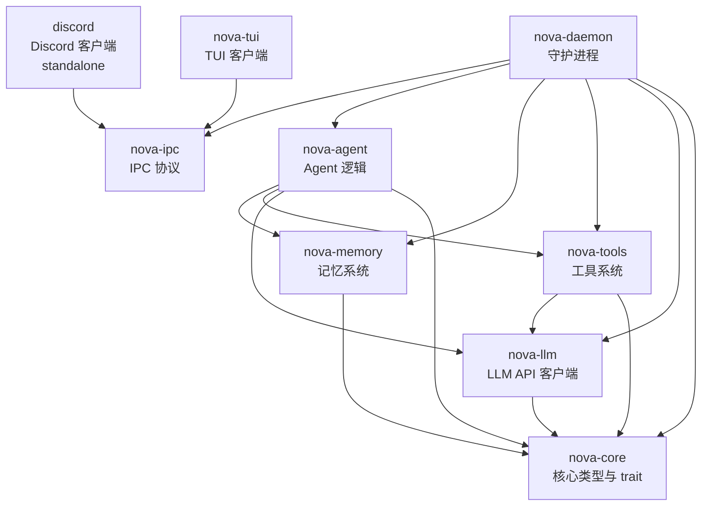
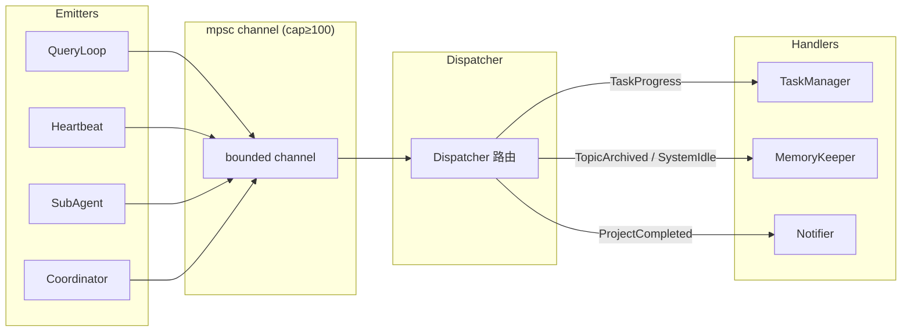

# NOVA

**Rust 重写的 OpenClaw Agent + Claude Code 16 策略 + 赛博朋克 TUI**

## 架构总览

NOVA 采用 8 crate workspace 结构，通过 TurnPipeline 处理每轮对话，使用 ShadowEvent 事件系统驱动后台任务，并以四层记忆架构管理长期知识。

### 8 Crate 依赖关系图



### Crate 职责

| Crate | 职责 |
|:------|:-----|
| `nova-core` | 核心类型：TurnContext, PipelineStage trait, LlmBackend trait, PlatformAdapter trait, Config, Message, ShadowEvent |
| `nova-llm` | Anthropic 兼容 HTTP 客户端，SSE 流式解析，实现 LlmBackend trait |
| `nova-tools` | ToolRegistry + 内置工具（bash, read_file, write_file, file_edit, glob, grep, browser, skills, team, worktree, paste） |
| `nova-memory` | 四层记忆架构, TopicTracker, TensionTracker, ModeRouter, SessionManager, DreamEngine, MemoryKeeper |
| `nova-agent` | AgentLoop, TurnPipeline 6 Stage, Token Budget/Compact, Coordinator, SubAgent, Heartbeat, Hooks |
| `nova-ipc` | Unix Domain Socket JSON lines 协议（client/server） |
| `nova-daemon` | 顶层组装：Dispatcher 事件路由, DiscordAdapter, TaskManager, ToolFactory, 进程管理 |
| `nova-tui` | 赛博朋克 TUI 客户端（ratatui + crossterm），通过 IPC 连接 daemon |
| `discord` | (standalone) 独立 Discord 客户端，通过 IPC 连接 daemon |

---

## 核心数据流

```
用户消息（Discord / TUI）
    │
    ▼
PlatformAdapter.start() → PlatformMessage
    │
    ▼
AgentLoop 接收消息
    │
    ▼
┌─────────────────────────────────────────────┐
│  TurnPipeline                               │
│  Classify → Track → Gate → Inject →        │
│  PlatformHint → ExecuteConfig               │
│  (共享 TurnContext)                          │
└─────────────────────────────────────────────┘
    │
    ▼
构建 CompletionRequest（system prompt + injections + tools）
    │
    ▼
LlmBackend.stream() → StreamDelta 事件流
    │
    ▼
解析 LLM 响应：文本 / 工具调用
    │
    ├── 工具调用 → ToolRegistry.execute() → ToolResult → 继续循环
    │
    └── 文本响应 / stop_reason=end_turn → 返回用户
    │
    ▼
PostSampling Hooks → StopHooks → 发送 ShadowEvent
```

---

## ShadowEvent 事件系统

ShadowEvent 是 Nova 的统一内部事件总线，采用 fire-and-forget 模式，将 Agent 主循环与后台服务解耦。

### 事件类型

| Event | 频率 | 发射者 | 处理者 | 用途 |
|:------|:-----|:-------|:-------|:-----|
| `TaskProgress` | 高频 | QueryLoop, Coordinator | TaskManager | Tasks.md CRUD 操作 |
| `TopicArchived` | 低频 | TopicTracker | MemoryKeeper | 话题归档 → 异步记忆提取 |
| `SystemIdle` | 低频 | Heartbeat | MemoryKeeper | 空闲时 flush 缓冲话题 |
| `ProjectCompleted` | 低频 | SubAgent | Dispatcher | 推送完成通知到 Discord/TUI |

### 事件流架构



**设计原则：**
- Fire-and-forget：发射者投递事件后立即继续，不阻塞
- 所有重 I/O（文件写入、LLM 调用）在 Handler 中异步执行
- bounded channel 容量 ≥ 100，防止背压阻塞主循环

---

## 记忆四层架构

Nova 的记忆系统分为四个层次，从短期到长期逐层沉淀：

```
┌─────────────────────────────────────────────────────┐
│  Layer 4: Session History (JSONL)                   │
│  完整对话记录，按 session 存储，支持 agentic search  │
├─────────────────────────────────────────────────────┤
│  Layer 3: Daily Memory (自动归档)                    │
│  每日对话摘要，由 MemoryConsolidator 定期整理        │
├─────────────────────────────────────────────────────┤
│  Layer 2: Topic Memory (话题级)                      │
│  TopicTracker 管理话题生命周期                        │
│  TopicArchived → MemoryKeeper → SideQuery 提取要点   │
├─────────────────────────────────────────────────────┤
│  Layer 1: MEMORY.md (长期工作记忆)                   │
│  跨会话持久化的核心知识：用户偏好、环境、惯例         │
│  由 MemoryKeeper 写入，MemoryBoard 管理白板格式      │
└─────────────────────────────────────────────────────┘
```

### 记忆组件

| 组件 | 模块 | 职责 |
|:-----|:-----|:-----|
| **TopicTracker** | `nova-memory/src/memory/topic_state.rs` | 话题状态机：Started → Active → Suspended → Archived |
| **TensionTracker** | `nova-memory/src/memory/tension_tracker.rs` | 张力值追踪：情绪/疲劳/意图检测 |
| **ModeRouter** | `nova-memory/src/memory/mode_router.rs` | 模式路由：Normal / SoftIntimate / HighIntimate / Cooling |
| **MemoryKeeper** | `nova-memory/src/sidequery/memory_keeper.rs` | 话题归档处理：通过 SideQuery 提取要点写入 MEMORY.md |
| **MemoryConsolidator** | `nova-memory/src/memory/consolidate.rs` | 定期整理：合并冗余记忆、清理过期条目 |
| **MemoryBoard** | `nova-memory/src/memory/memory_board.rs` | MEMORY.md 白板管理：结构化读写 |
| **DreamEngine** | `nova-memory/src/dream/engine.rs` | 空闲时自动整理建议（autoDream） |
| **SessionManager** | `nova-memory/src/session/manager.rs` | Session JSONL 存储与检索 |
| **AgenticSessionSearch** | `nova-memory/src/session/search.rs` | 基于 LLM 的智能会话搜索 |

### 记忆写入保障

所有对 MEMORY.md、tasks.md、session meta.json 的写入均使用 `nova-core::atomic_write` 原子写入（temp + rename），确保写入中断不损坏已有数据。

---

## 快速开始

```bash
# 配置
mkdir -p ~/.nova
cat > ~/.nova/config << 'EOF'
api_key = "<your-api-key>"
model = "MiniMax-M2.7"
api_base_url = "https://api.minimaxi.com/anthropic"
EOF

# 编译
cargo build --release

# 启动守护进程
./target/release/nova-daemon run &

# 连接 TUI
./target/release/nova-tui
```

## 已实现的 Claude Code 策略

| # | 策略 | 模块 |
|:--|:---|:---|
| 1 | Query Loop | `nova-agent/src/agent_loop.rs` |
| 2 | Token Budget 双阈值 | `nova-agent/src/token/budget.rs` |
| 3 | Compact 对话压缩 | `nova-agent/src/token/compact.rs` |
| 4 | Forked Agent | `nova-agent/src/forked.rs` |
| 5 | PostSampling Hooks | `nova-agent/src/hooks/post_sampling.rs` |
| 6 | StopHooks | `nova-agent/src/hooks/stop.rs` |
| 7 | 双写互斥记忆 | `nova-memory/src/memory/dual_write.rs` |
| 8 | 工具池稳定排序 | `nova-tools/src/registry.rs` |
| 9 | Team 系统 | `nova-tools/src/team/` |
| 10 | Subagent spawn | `nova-agent/src/subagent/` |
| 11 | SideQuery | `nova-memory/src/sidequery/` |
| 12 | autoDream | `nova-memory/src/dream/` |
| 13 | Worktree 隔离 | `nova-tools/src/worktree/` |
| 14 | Coordinator 模式 | `nova-agent/src/coordinator/` |
| 15 | Paste Store | `nova-tools/src/paste/` |
| 16 | Session History JSONL | `nova-memory/src/session/` |

## 工具

| 工具 | 描述 |
|:---|:---|
| `bash` | 受限模式 shell（黑名单 + 路径保护 + 禁止提权） |
| `read_file` | 文件读取（支持行范围） |
| `write_file` | 文件写入（overwrite/append） |
| `file_edit` | 文件编辑（search/replace） |
| `glob` | 文件搜索 |
| `grep` | 内容搜索 |
| `browser` | 网页浏览 |
| `agentic_search` | 智能搜索 |
| `skills_list` | Skill 元数据列表（渐进式披露 Tier 1） |
| `skill_view` | Skill 完整内容查看（Tier 2） |
| `skill_manage` | Skill CRUD 管理 |

## 技术栈

- Rust 2021 edition
- tokio 异步运行时
- ratatui + crossterm TUI
- reqwest HTTP + SSE 流式
- serde + serde_json 序列化
- Unix Domain Socket IPC
- serenity Discord gateway
- proptest 属性测试
