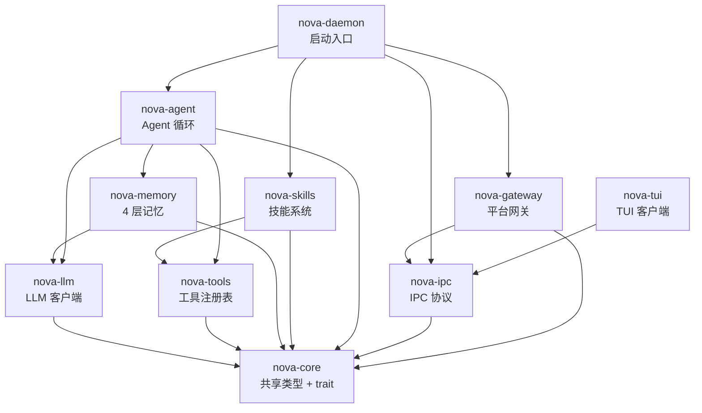

# Nova V2 架构设计方案

> 基于 hermes-rs harness 模式的渐进式重构

---

## 一、设计原则

借鉴 hermes-rs，但不照搬。Nova 的核心差异在于：

| 维度 | hermes-rs | Nova |
|:--|:--|:--|
| 定位 | 通用 Agent 框架 | **个人 AI 伴侣**（带记忆、人格、情绪） |
| 部署模型 | 单进程 CLI | **Daemon + TUI + Discord 三端** |
| 核心策略 | 技能自进化 | **16 Claude Code 策略 + Preflight 状态机** |
| 记忆系统 | SQLite + FTS5 | **4 层记忆（工作/日记/整合/梦境）** |

因此 Nova V2 的架构目标不是"变成 hermes"，而是：

1. **用 trait 替代 if-else** — 编译器强制实现所有分支
2. **用 crate DAG 替代 God Object** — 改一个工具不重编译 Agent 循环
3. **用策略层替代行内注释** — `[V6] Hard Gate` 变成可测试的 `AgentPolicy` 接口
4. **保留现有全部功能** — 不砍任何已验证的能力

---

## 二、Crate DAG 重组

### 当前结构（5 crate，但 nova-core 是个万能包）

```
nova-api → nova-core(万能包) → nova-daemon(God Object)
                              ↗
nova-ipc ──────────────────→ nova-tui
```

`nova-core` 包含 21 个子模块，涵盖 tools/memory/agent/coordinator/skills/session 等所有逻辑。

### 目标结构（10 crate）

```
nova-core ─────────────────────────────────────── 共享类型 + 核心 trait
    │
nova-llm ─── nova-core ─────────────────────────── LLM 客户端（原 nova-api）
    │
nova-tools ── nova-core ─────────────────────────── 工具注册表 + 所有内置工具
    │
nova-memory ── nova-core ── nova-llm ────────────── 4 层记忆系统
    │
nova-agent ── nova-core ── nova-llm ── nova-tools ── nova-memory ── 核心 Agent 循环
    │
nova-ipc ──── nova-core ────────────────────────── IPC 协议（不变）
    │
nova-gateway ── nova-core ── nova-ipc ───────────── 平台适配（Discord + 未来 Telegram 等）
    │
nova-daemon ── nova-agent ── nova-gateway ── nova-ipc ── 启动入口
    │
nova-tui ──── nova-ipc ─────────────────────────── TUI 客户端（不变）
    │
nova-skills ── nova-core ── nova-tools ──────────── 技能系统（独立 crate）
```

### 各 crate 职责

| Crate | 来源 | 行数(估) | 职责 |
|:--|:--|:--|:--|
| `nova-core` | 新建 | ~500 | 共享类型：Message, ToolCall, ShadowEvent, Config + 5 个核心 trait |
| `nova-llm` | 原 `nova-api` 重命名 | ~800 | LLM 客户端：SSE streaming, complete, SideQuery |
| `nova-tools` | 从 `nova-core/tools/` 提取 | ~3000 | ToolRegistry + 所有内置工具 + delegate 系列 |
| `nova-memory` | 从 `nova-core/memory/` 提取 | ~2500 | TopicTracker, TensionTracker, MemoryBoard, DailyNotes, Dream, Recall, Consolidate |
| `nova-agent` | 从 `nova-core/agent/` 提取 | ~1500 | QueryLoop, Preflight, AgentPolicy, Coordinator, SubagentSpawner |
| `nova-ipc` | 不变 | ~400 | JSON Lines over UDS |
| `nova-gateway` | 从 `nova-daemon/discord.rs` 提取 | ~800 | PlatformAdapter trait + Discord 实现 |
| `nova-daemon` | 瘦化 | ~300 | main() 启动、PID 管理、依赖组装 |
| `nova-tui` | 不变 | ~700 | Ratatui 客户端 |
| `nova-skills` | 从 `nova-core/skills/` 提取 | ~1600 | SkillsLoader, CRUD, fuzzy match |

### DAG 可视化



---

## 三、5 个核心 Trait

所有 trait 定义在 `nova-core` 中，各 crate 提供具体实现。

### 1. LlmBackend — LLM 调用抽象

```rust
// nova-core/src/llm.rs

#[async_trait]
pub trait LlmBackend: Send + Sync {
    /// 单次完整调用
    async fn complete(&self, req: &CompletionRequest) -> Result<CompletionResponse>;

    /// 流式调用
    async fn stream(
        &self,
        req: &CompletionRequest,
        tx: mpsc::Sender<StreamDelta>,
    ) -> Result<CompletionResponse>;
}
```

**当前状态**：`nova-api/client.rs` 的 `ApiClient` 已经有 `complete()` 和 `stream()`，但没有 trait 抽象。`SideQuery` 内部创建独立的 `ApiClient`。

**改造收益**：
- 未来支持多 provider（OpenRouter / 本地模型）只需实现 `LlmBackend`
- 测试时用 `MockLlmBackend` 替换真实 API 调用
- `SideQuery` 不再自行创建 `ApiClient`，接收 `Arc<dyn LlmBackend>`

### 2. ToolHandler — 工具执行抽象

```rust
// nova-core/src/tool.rs

/// 工具执行上下文 — 传递运行时信息
pub struct ToolContext {
    pub channel_id: String,       // 当前会话/频道 ID
    pub workspace_dir: PathBuf,   // 工作区根目录
    pub timeout: Duration,        // 超时时间
}

#[async_trait]
pub trait ToolHandler: Send + Sync {
    fn name(&self) -> &str;
    fn description(&self) -> &str;
    fn input_schema(&self) -> Value;

    /// 执行工具，接收上下文
    async fn execute(&self, input: Value, ctx: &ToolContext) -> Result<String>;
}
```

**与当前 `Tool` trait 的区别**：增加 `ToolContext` 参数。当前 `Tool::execute` 只接收 `input`，导致工具内部需要用 `task_local!` (`CURRENT_CHANNEL_ID`) 等 hack 传递上下文。

### 3. MemoryLayer — 记忆层抽象

```rust
// nova-core/src/memory.rs

/// 记忆层级
pub enum MemoryTier {
    Working,    // MEMORY.md — 即时工作记忆
    Episodic,   // daily/ — 日记（每轮压缩时写入）
    Semantic,   // 整合层 — TopicArchived 时提取
    Procedural, // 梦境层 — 空闲时自动整合
}

/// 统一的记忆操作接口
#[async_trait]
pub trait MemoryLayer: Send + Sync {
    fn tier(&self) -> MemoryTier;

    /// 写入记忆
    async fn store(&self, content: &str, metadata: &MemoryMeta) -> Result<()>;

    /// 召回相关记忆
    async fn recall(&self, query: &str, limit: usize) -> Result<Vec<MemoryEntry>>;

    /// 整合/压缩（可选，默认 no-op）
    async fn consolidate(&self) -> Result<()> { Ok(()) }
}
```

**当前状态**：DailyNotes、MemoryRecall、MemoryConsolidator、DreamEngine、MemoryBoard 各自独立，在 `main.rs` 中逐个创建并传入 QueryLoop。

**改造收益**：QueryLoop 持有 `Vec<Arc<dyn MemoryLayer>>`，按 tier 调度。新增记忆后端（如 SQLite+FTS5）只需实现 trait。

### 4. PlatformAdapter — 消息平台抽象

```rust
// nova-core/src/platform.rs

#[derive(Debug, Clone, PartialEq)]
pub enum Platform {
    Tui,
    Discord,
    // 未来: Telegram, Slack, WeChat
}

#[async_trait]
pub trait PlatformAdapter: Send + Sync {
    fn platform(&self) -> Platform;

    /// 发送消息到指定频道/会话
    async fn send(&self, channel_id: &str, content: &str) -> Result<()>;

    /// 启动事件监听循环（消息通过 tx 发送给 daemon）
    async fn start(&mut self, tx: mpsc::Sender<PlatformMessage>) -> Result<()>;
}

pub struct PlatformMessage {
    pub platform: Platform,
    pub channel_id: String,
    pub user_id: String,
    pub content: String,
}
```

**当前状态**：Discord 在 `discord.rs` 中硬编码，TUI 通过 IPC 走完全不同的路径。两者共享 session 但代码路径完全独立。

**改造收益**：`nova-daemon` 的主循环统一处理所有平台消息，Discord/TUI 都是 `PlatformAdapter` 的实现。

### 5. AgentPolicy — 策略决策抽象

```rust
// nova-core/src/policy.rs

/// 策略决策结果
pub struct PolicyDecision {
    /// 本轮可用的工具名称列表
    pub allowed_tools: Vec<String>,
    /// 是否在委派后立即终止循环
    pub terminate_after_delegation: bool,
    /// 注入到 system prompt 的额外上下文
    pub prompt_injection: String,
}

#[async_trait]
pub trait AgentPolicy: Send + Sync {
    /// 在每轮 API 调用前，根据用户输入和上下文决定工具可见性和行为
    async fn decide(
        &self,
        user_input: &str,
        recent_messages: &[Message],
        all_tools: &ToolRegistry,
    ) -> PolicyDecision;
}
```

**当前状态**：`loop.rs:178-197` 的 `[V6] Hard Gate` match 块 + `loop.rs:556-572` 的委派终止 if-else。散布在行内代码中。

**改造收益**：
- `PreflightPolicy` 实现当前的 Preflight → Hard Gate 逻辑
- `PassthroughPolicy` 实现无过滤的直通模式（用于 SubAgent）
- 策略可单独测试，不需要启动完整 Agent

---

## 四、QueryLoop 重构后的样子

```rust
// nova-agent/src/loop.rs — 重构后约 200 行（当前 738 行）

pub struct QueryLoop {
    config: QueryLoopConfig,
    llm: Arc<dyn LlmBackend>,
    tools: Arc<ToolRegistry>,
    policy: Arc<dyn AgentPolicy>,
    memory: Vec<Arc<dyn MemoryLayer>>,
    hooks: HookManager,
    event_bus: mpsc::Sender<ShadowEvent>,
}

impl QueryLoop {
    pub async fn run_turn(
        &self,
        session: &mut Session,
        system_prompt: &str,
        event_tx: mpsc::Sender<LoopEvent>,
    ) -> Result<TurnResult> {
        // 1. 策略决策
        let decision = self.policy.decide(
            &user_input, &session.messages, &self.tools
        ).await;

        // 2. 构建请求（注入策略上下文）
        let tool_schemas = self.tools.filter_by_names(&decision.allowed_tools);
        let effective_prompt = format!("{}\n{}", system_prompt, decision.prompt_injection);

        // 3. 核心循环（流式调用 → 工具执行 → 判断终止）
        loop {
            let resp = self.llm.stream(&req, stream_tx).await?;
            // ... 收集响应 ...

            if tool_calls.is_empty() { break; }

            // 执行工具
            for tc in &tool_calls {
                let result = self.tools.execute(&tc.name, tc.input.clone(), &ctx).await?;
                // ...
            }

            // 策略驱动的终止判断
            if decision.terminate_after_delegation && has_delegation(&tool_calls) {
                break;
            }
        }

        // 4. 触发记忆写入
        for layer in &self.memory {
            layer.store(&turn_summary, &meta).await.ok();
        }

        Ok(TurnResult { session, new_messages, preflight })
    }
}
```

**关键变化**：
- QueryLoop 不再持有 `Option<Arc<RwLock<TopicTracker>>>` 等一堆可选字段
- 策略逻辑委托给 `AgentPolicy`，QueryLoop 只调接口
- 记忆操作统一通过 `MemoryLayer` trait
- LLM 调用通过 `LlmBackend` trait，可 mock 测试

---

## 五、nova-daemon main.rs 重构后的样子

```rust
// nova-daemon/src/main.rs — 重构后约 80 行

#[tokio::main]
async fn main() -> Result<()> {
    let config = NovaConfig::load_default()?;
    tracing_init(&config);

    match std::env::args().nth(1).as_deref().unwrap_or("run") {
        "run"  => run_daemon(config).await,
        "stop" => send_shutdown().await,
        _      => { eprintln!("Usage: nova [run|stop]"); Ok(()) }
    }
}

async fn run_daemon(config: NovaConfig) -> Result<()> {
    let _pid = PidGuard::acquire()?;

    // 1. 构建核心组件（全部通过 trait 接口）
    let llm: Arc<dyn LlmBackend> = Arc::new(ApiClient::new(&config));
    let tools = tool_factory::build(&config, llm.clone());
    let memory = memory_factory::build(&config, llm.clone());
    let policy: Arc<dyn AgentPolicy> = Arc::new(PreflightPolicy::new(llm.clone()));
    let event_bus = Dispatcher::spawn(&config);

    // 2. 启动平台网关
    let (platform_tx, platform_rx) = mpsc::channel(64);
    gateway::start_all(&config, platform_tx, event_bus.clone()).await?;

    // 3. IPC 服务器主循环
    let server = IpcServer::bind(SOCKET_PATH).await?;
    session_handler::serve(server, platform_rx, llm, tools, memory, policy, event_bus).await
}
```

**关键变化**：
- `main.rs` 只做组装和启动，不包含任何业务逻辑
- `tool_factory`、`memory_factory`、`session_handler` 各自独立模块
- 所有组件通过 trait 接口连接

---

## 六、迁移路线图

> 每阶段可独立编译验证，不破坏现有功能。

### Stage 0：清理 (0.5 天)
- 删除 `build_nova_os_section()`、`mode_router` 创建、`CompactResult` DEPRECATED 字段
- 删除 `fixbug/` 目录、根目录 `~` 文件夹
- 删除 `WorkspaceLoader` legacy 代码
- **验证**：`cargo build --release` 通过

### Stage 1：提取 nova-core 共享类型 (1 天)
- 新建 `nova-core` crate，从现有 `nova-core` 搬入：`message.rs`, `models/events.rs`, `config.rs`
- 定义 5 个核心 trait（空实现）
- 原 `nova-core` 临时重命名为 `nova-engine`（过渡用）
- **验证**：所有 crate 编译通过

### Stage 2：提取 nova-tools + nova-memory (1.5 天)
- `nova-tools`：搬入 `tools/` 全部文件，`ToolHandler` trait 替换 `Tool` trait
- `nova-memory`：搬入 `memory/` 全部文件，实现 `MemoryLayer` trait
- 合并 `delegate_task.rs` 和 `delegate_complex_project.rs` 的公共基础
- **验证**：`cargo test` 通过

### Stage 3：提取 nova-agent + AgentPolicy (1 天)
- `nova-agent`：搬入 `agent/`, `coordinator/`, `subagent/`
- 实现 `PreflightPolicy`，从 `loop.rs` 提取 Hard Gate + 委派终止逻辑
- QueryLoop 重构为接收 trait 接口
- **验证**：端到端对话可用

### Stage 4：瘦化 nova-daemon + 提取 nova-gateway (1 天)
- `nova-gateway`：搬入 `discord.rs`，实现 `PlatformAdapter`
- `nova-daemon`：瘦化到 ~80 行入口 + 模块化的 factory/handler
- 原 `nova-engine` 删除（所有代码已迁移）
- **验证**：TUI + Discord 双端可用

### 总计：~5 天集中重构

---

## 七、经济学分析

| 对比项 | 继续打补丁 | Stage 0-2 (3天) | 全量 Stage 0-4 (5天) |
|:--|:--|:--|:--|
| 下次加功能耗时 | 1-2 天 | 0.5-1 天 | 0.5 天 |
| 下次修 bug 风险 | 高（改 main.rs 影响全局） | 中 | 低（改 nova-tools 不影响 nova-agent） |
| 增量编译时间 | 全量（nova-core 任何改动触发全部重编） | 减半 | 秒级（只重编改动的 crate） |
| 可测试性 | 几乎不可测 | tools/memory 可单测 | 全栈可 mock 测试 |
| 新平台接入成本 | 复制 discord.rs 改 | 复制 discord.rs 改 | 实现 PlatformAdapter |

> **建议**：至少做 Stage 0-2（3 天），拿到 trait 化 + crate 拆分的核心收益。Stage 3-4 可在后续迭代中完成。

---

## 八、与 hermes-rs 的关键差异总结

| 决策点 | hermes-rs 做法 | Nova V2 做法 | 理由 |
|:--|:--|:--|:--|
| 状态存储 | SQLite + FTS5 | 保留 Markdown 文件 + JSONL | Nova 的记忆是"人格化"的，Markdown 更适合 LLM 读写 |
| 技能系统 | 自进化（任务→技能） | 保留现有 CRUD + fuzzy match | 自进化需要大量 token 消耗，当前阶段不划算 |
| 平台网关 | 18+ 适配器 | Discord + TUI（PlatformAdapter 预留扩展） | 按需扩展，不过度设计 |
| Agent 循环 | 单层循环 | QueryLoop + Coordinator 双层 | Nova 需要 Preflight → Hard Gate 的策略拦截 |
| 安全模型 | hermes-security 独立 crate | 保留 bash/security 在 nova-tools 内 | Nova 的安全主要是 bash sandbox，不需要独立 crate |
