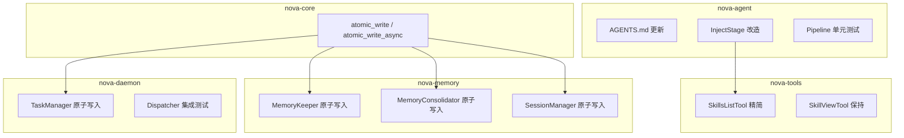

# 设计文档：R4 自进化

## 概述

R4「自进化」是 Nova V2 的最终阶段，在 R1（TurnPipeline 闭环）、R2（8 crate 拆分）、R3（trait 化接口与安全防护）基础上，完成以下四个维度的强化：

1. **行为规范强化** — 更新 AGENTS.md，明确记忆内容策略和工具使用纪律
2. **Skill 渐进式披露** — 将 Skill 注入从"全量灌入"改为"摘要列表 + 按需查看"，节省 token
3. **数据写入可靠性** — 统一原子写入工具函数，消除写入中断导致数据损坏的风险
4. **测试覆盖** — 补充 Pipeline 单元测试和 Dispatcher 集成测试，验证核心路径正确性

### 设计原则

- **最小侵入**：尽量复用现有接口，不改变 crate 间依赖关系
- **向后兼容**：SkillManageTool 的 create/patch/delete 行为不变
- **渐进交付**：每个子任务可独立编译验证

---

## 架构

### 变更影响范围



### 数据流变更

**Skill 注入流（变更前）：**
```
SkillsLoader.load_all() → 全部 Skill.prompt → InjectStage → system prompt（大量 token）
```

**Skill 注入流（变更后）：**
```
SkillsLoader.load_all() → 仅 name+description 摘要 → InjectStage → <available-skills> 标签
                        → auto_trigger 匹配 → 匹配 Skill 完整内容注入
Agent 需要详情时 → skill_view(name) → 完整 SKILL.md 内容
```

---

## 组件与接口

### 1. AGENTS.md 更新

**文件路径**：`nova-agent/prompts/AGENTS.md`（同步到 `nova-core/prompts/AGENTS.md`）

**变更内容**：

#### 1.1 记忆系统章节扩展

在现有"二、记忆系统"章节中增加明确的内容策略：

```markdown
### 记忆内容策略

**应存储（高价值、跨会话持久）：**
- 用户偏好（编程风格、语言选择、工具偏好）
- 环境细节（OS、开发环境、常用路径）
- 工具使用技巧（特定命令的正确用法）
- 稳定惯例（项目约定、命名规范）
- 用户纠正过的行为（"不要做 X，应该做 Y"）

**不应存储（短期、可查询、已有其他机制）：**
- 任务进度（由 tasks.md 管理）
- Session 结果（由 session history 保存）
- 已完成工作日志（由 daily memory 自动归档）
- 临时 TODO 状态（由 TaskManager 管理）

**核心原则：最有价值的记忆是不需要用户再次纠正你的记忆。**

**工具分流指南：**
- 发现新方法或解决可复用问题 → 使用 `skill_manage(action="create")` 固化为 Skill
- 需要回忆过去对话内容 → 使用 `session_search` 检索历史
- 仅当信息属于"应存储"类别时 → 写入 MEMORY.md
```

#### 1.2 新增"工具使用纪律"章节

位于"三、技能系统"和"四、安全红线"之间（新编号为"四、工具使用纪律"，原安全红线变为"五"）：

```markdown
## 四、工具使用纪律

### 核心规则

1. **言行一致**：当你声明将执行某操作时（如"我来检查文件"、"让我运行测试"），
   必须在同一回复中发起对应的工具调用。仅描述意图而不行动的回复不可接受。

2. **持续推进**：必须持续调用工具直到任务完成且结果经过验证，
   不得以"下次继续"或"你可以自己试试"结束回复。

3. **每条回复的要求**：要么包含推进任务的工具调用，要么向用户交付最终结果。

4. **重试而非放弃**：工具返回空结果或部分结果时，应尝试不同查询策略重试，
   而非直接放弃并告知用户"没找到"。

### 必须使用工具的场景

以下场景禁止凭记忆回答，必须调用工具获取实时数据：
- 数学计算 → `bash`（计算器）
- 系统状态查询 → `bash`（ps, df, etc.）
- 文件内容读取 → `read_file`
- Git 历史查询 → `bash`（git log, git diff）
- 当前时间获取 → `bash`（date）
```

### 2. Skill 渐进式披露

#### 2.1 SkillsListTool（已实现，确认行为）

当前 `nova-tools/src/skills/lister.rs` 的 `SkillsListTool` 已经只返回 `SkillMeta { name, description, category }`，不包含完整 prompt。需求 3 的验收标准已满足，无需代码变更。

#### 2.2 SkillViewTool（已实现，确认行为）

当前 `nova-tools/src/skills/viewer.rs` 的 `SkillViewTool` 已支持：
- `name` 参数返回完整 SKILL.md
- `file_path` 参数返回关联文件
- 路径遍历检测（`validate_skill_path`）

需求 4 的验收标准已满足，无需代码变更。

#### 2.3 InjectStage 改造

**文件**：`nova-agent/src/stages/inject.rs`

**变更**：

1. 移除现有的全量 Skill 注入逻辑（如果存在）
2. 新增 Skill 摘要注入：从 `SharedSkillsLoader` 读取所有 Skill 元数据，生成摘要列表
3. 保留 auto_trigger 机制：匹配当前 `user_input` 的 Skill 仍注入完整内容

**接口变更**：

```rust
pub struct InjectStage {
    memories_dir: Option<std::path::PathBuf>,
    skills_loader: Option<SharedSkillsLoader>,  // 新增
}

impl InjectStage {
    pub fn new(
        memories_dir: Option<std::path::PathBuf>,
        skills_loader: Option<SharedSkillsLoader>,  // 新增参数
    ) -> Self { ... }

    /// 生成 Skill 摘要列表（仅 name + description）
    pub fn build_skills_summary(loader: &SkillsLoader) -> String { ... }

    /// 检查 auto_trigger 并返回匹配的完整 Skill 内容
    pub fn get_auto_triggered_skills(loader: &SkillsLoader, user_input: &str) -> Vec<String> { ... }
}
```

**注入格式**：

```xml
<available-skills>
可用技能列表（使用 skill_view(name) 查看详情）：
- skill-name-1: 描述文字
- skill-name-2: 描述文字
</available-skills>
```

auto_trigger 匹配的 Skill 使用独立标签：

```xml
<auto-triggered-skill name="skill-name">
完整 SKILL.md 内容
</auto-triggered-skill>
```

### 3. 原子写入工具函数

#### 3.1 nova-core 公共函数

**文件**：`nova-core/src/atomic_write.rs`（新建模块）

```rust
use std::path::Path;
use std::io::Write;
use anyhow::Result;

/// 同步原子写入：temp 文件写入 + rename。
/// temp 文件命名：同目录下 `.{filename}.tmp`
pub fn atomic_write(path: &Path, content: &[u8]) -> Result<()> {
    let parent = path.parent().unwrap_or(Path::new("."));
    let filename = path.file_name()
        .ok_or_else(|| anyhow::anyhow!("invalid path: no filename"))?;
    let temp_path = parent.join(format!(".{}.tmp", filename.to_string_lossy()));

    // 确保父目录存在
    std::fs::create_dir_all(parent)?;

    // 写入临时文件
    let write_result = (|| -> Result<()> {
        let mut file = std::fs::File::create(&temp_path)?;
        file.write_all(content)?;
        file.sync_all()?;  // fsync 确保数据落盘
        Ok(())
    })();

    if let Err(e) = write_result {
        let _ = std::fs::remove_file(&temp_path);
        return Err(e);
    }

    // 原子 rename
    if let Err(e) = std::fs::rename(&temp_path, path) {
        let _ = std::fs::remove_file(&temp_path);
        return Err(anyhow::anyhow!("atomic rename failed: {}", e));
    }

    Ok(())
}

/// 异步原子写入：使用 tokio::fs。
pub async fn atomic_write_async(path: &Path, content: &[u8]) -> Result<()> {
    let parent = path.parent().unwrap_or(Path::new("."));
    let filename = path.file_name()
        .ok_or_else(|| anyhow::anyhow!("invalid path: no filename"))?;
    let temp_path = parent.join(format!(".{}.tmp", filename.to_string_lossy()));

    // 确保父目录存在
    tokio::fs::create_dir_all(parent).await?;

    // 写入临时文件
    let write_result = tokio::fs::write(&temp_path, content).await;
    if let Err(e) = write_result {
        let _ = tokio::fs::remove_file(&temp_path).await;
        return Err(anyhow::anyhow!("atomic write failed: {}", e));
    }

    // 原子 rename
    if let Err(e) = tokio::fs::rename(&temp_path, path).await {
        let _ = tokio::fs::remove_file(&temp_path).await;
        return Err(anyhow::anyhow!("atomic rename failed: {}", e));
    }

    Ok(())
}
```

**模块注册**：在 `nova-core/src/lib.rs` 中添加 `pub mod atomic_write;`

#### 3.2 集成点

| 组件 | 文件 | 替换目标 | 使用版本 |
|:-----|:-----|:---------|:---------|
| MemoryKeeper | `nova-memory/src/sidequery/memory_keeper.rs` | `fs::write(&memory_path, updated)` | `atomic_write_async` |
| MemoryConsolidator | `nova-memory/src/memory/consolidate.rs` | `fs::write(&memory_path, response)` | `atomic_write`（同步上下文） |
| DreamEngine | `nova-memory/src/dream/engine.rs` | 当前无直接 MEMORY.md 写入（通过 SideQuery 建议） | 预留，暂不改动 |
| TaskManager | `nova-daemon/src/task_manager.rs` | `std::fs::write(&self.tasks_path, ...)` | `atomic_write` |
| SessionManager | `nova-memory/src/session/manager.rs` | `std::fs::write(path, ...)` in `save_meta()` | `atomic_write` |

**注意**：`nova-tools/src/skills/security.rs` 中已有一个 `atomic_write` 函数，但它是 skills 专用的。新的 `nova-core::atomic_write` 是通用版本，后续可考虑让 skills 模块也迁移到 nova-core 版本。

### 4. Pipeline 单元测试

#### 4.1 高复杂度场景测试

**文件**：`nova-agent/tests/pipeline_high_complexity.rs`

**测试策略**：
- 构造 mock `PreFlightChecker`，固定返回 `Complexity::High`
- 组装 Pipeline：ClassifyStage → GateStage → ExecuteConfigStage
- 验证 TurnContext 最终状态

```rust
// 伪代码结构
#[tokio::test]
async fn test_high_complexity_pipeline() {
    let mock_checker = MockPreFlightChecker::new(Complexity::High, false);
    let pipeline = TurnPipeline::new()
        .with(ClassifyStage::new(Arc::new(mock_checker), 5))
        .with(GateStage::new())
        .with(ExecuteConfigStage::new());

    let mut ctx = TurnContext::new("帮我重构整个项目".into(), vec![]);
    pipeline.run(&mut ctx).await.unwrap();

    assert_eq!(ctx.complexity, Complexity::High);
    assert_eq!(ctx.allowed_tools, Some(vec![
        "delegate_complex_project".into(),
        "cancel_delegated_project".into(),
    ]));
    assert!(ctx.should_terminate_after_tool);
}
```

#### 4.2 低复杂度 + 话题切换测试

**文件**：`nova-agent/tests/pipeline_low_topic_shift.rs`

```rust
#[tokio::test]
async fn test_low_complexity_topic_shift() {
    let mock_checker = MockPreFlightChecker::new(Complexity::Low, true);
    let pipeline = TurnPipeline::new()
        .with(ClassifyStage::new(Arc::new(mock_checker), 5))
        .with(GateStage::new())
        .with(ExecuteConfigStage::new());

    let mut ctx = TurnContext::new("你几岁了？".into(), vec![/* 技术讨论历史 */]);
    pipeline.run(&mut ctx).await.unwrap();

    assert_eq!(ctx.complexity, Complexity::Low);
    assert!(ctx.topic_shift);
    assert!(ctx.allowed_tools.is_none()); // 不限制工具
    assert!(!ctx.should_terminate_after_tool);
}
```

**Mock 设计**：需要为 `PreFlightChecker` 提供 mock 实现。由于 `ClassifyStage` 直接持有 `Arc<PreFlightChecker>`，需要确保 `PreFlightChecker` 是 trait 或可 mock 的结构。

如果 `PreFlightChecker` 当前不是 trait，测试方案改为：
- 跳过 ClassifyStage，直接手动设置 `ctx.complexity` 和 `ctx.topic_shift`
- 仅测试 GateStage + ExecuteConfigStage 的行为

### 5. Dispatcher 集成测试

**文件**：`nova-daemon/tests/dispatcher_topic_archived.rs`

**测试策略**：
- 创建真实 Dispatcher + 真实 MemoryKeeper（使用 mock SideQuery）
- 通过 DispatcherSender 发送 TopicArchived 事件
- 验证 MemoryKeeper 的 buffer 增长

```rust
#[tokio::test]
async fn test_topic_archived_routes_to_memory_keeper() {
    let temp_dir = tempfile::tempdir().unwrap();
    let mock_side_query = SideQuery::new(mock_backend(), "test".into());
    let memory_keeper = Arc::new(MemoryKeeper::new(
        temp_dir.path().to_path_buf(),
        mock_side_query,
    ));

    let dispatcher = Dispatcher::new(temp_dir.path().to_path_buf())
        .with_memory_keeper(memory_keeper.clone());
    let sender = dispatcher.spawn();

    // 发送 TopicArchived 事件
    let transcript = vec![Message::user("hello"), Message::assistant("hi")];
    sender.emit(ShadowEvent::TopicArchived { transcript: transcript.clone() });

    // 等待异步处理
    tokio::time::sleep(Duration::from_millis(100)).await;

    // 验证 MemoryKeeper 收到了 transcript
    assert_eq!(memory_keeper.buffer_size().await, 1);
}

#[tokio::test]
async fn test_topic_archived_without_memory_keeper_no_panic() {
    let temp_dir = tempfile::tempdir().unwrap();
    let dispatcher = Dispatcher::new(temp_dir.path().to_path_buf());
    let sender = dispatcher.spawn();

    // 不配置 MemoryKeeper，发送事件不应 panic
    sender.emit(ShadowEvent::TopicArchived {
        transcript: vec![Message::user("test")],
    });

    tokio::time::sleep(Duration::from_millis(100)).await;
    // 如果没有 panic，测试通过
}
```

### 6. 文档更新

#### 6.1 CLAUDE.md

更新内容：
- Crate 结构从 4 crate 更新为 8 crate（nova-core, nova-llm, nova-tools, nova-memory, nova-agent, nova-ipc, nova-daemon, discord）
- 添加 TurnPipeline Stage 说明（Classify→Track→Gate→Inject→PlatformHint→ExecuteConfig）
- 添加 LlmBackend / PlatformAdapter trait 说明
- 更新依赖图

#### 6.2 docs/README.md

更新内容：
- 8 crate 依赖关系图（Mermaid）
- 核心数据流描述
- ShadowEvent 事件系统描述
- 记忆系统四层架构描述

---

## 数据模型

### SkillMeta（已存在，无变更）

```rust
pub struct SkillMeta {
    pub name: String,
    pub description: String,
    pub category: Option<String>,
}
```

### InjectStage 新增字段

```rust
pub struct InjectStage {
    memories_dir: Option<PathBuf>,
    skills_loader: Option<SharedSkillsLoader>,  // 新增
}
```

### atomic_write 模块（新增）

无新数据模型，仅提供函数接口：
- `pub fn atomic_write(path: &Path, content: &[u8]) -> Result<()>`
- `pub async fn atomic_write_async(path: &Path, content: &[u8]) -> Result<()>`

---

## 正确性属性

*正确性属性是在系统所有有效执行中都应成立的特征或行为——本质上是对系统应做什么的形式化陈述。属性是人类可读规范与机器可验证正确性保证之间的桥梁。*

### Property 1: SkillsListTool 输出仅包含元数据且按字母序排列

*For any* 非空的 Skill 集合，SkillsListTool 的返回结果 SHALL 仅包含 name、description、category 字段（不包含完整 prompt 内容），且按 name 字母序排列。

**Validates: Requirements 3.1, 3.2, 3.3, 3.4**

### Property 2: SkillsListTool 类别过滤正确性

*For any* Skill 集合和任意 category 过滤值，SkillsListTool 返回的结果 SHALL 仅包含匹配该 category 的 Skill，且不遗漏任何匹配项。

**Validates: Requirements 3.5**

### Property 3: SkillViewTool 内容完整性

*For any* 存在于磁盘的 Skill，SkillViewTool 返回的内容 SHALL 与磁盘上 SKILL.md 文件的内容完全一致。

**Validates: Requirements 4.1**

### Property 4: SkillViewTool 路径遍历拒绝

*For any* 包含 `..` 路径遍历字符的 file_path 参数，SkillViewTool SHALL 拒绝请求并返回安全错误。

**Validates: Requirements 4.4**

### Property 5: InjectStage Skill 摘要注入格式

*For any* 非空的 Skill 集合，InjectStage 注入的 Skill 相关内容 SHALL 使用 `<available-skills>` 标签包裹，且仅包含 name 和 description 摘要，不包含完整 prompt 内容。

**Validates: Requirements 5.1, 5.2, 5.4**

### Property 6: InjectStage auto_trigger 完整注入

*For any* 具有 auto_trigger keywords 的 Skill，当用户消息包含匹配关键词时，InjectStage SHALL 注入该 Skill 的完整内容。

**Validates: Requirements 5.3**

### Property 7: atomic_write 内容保持性

*For any* 有效路径和任意字节内容，atomic_write 成功完成后，目标文件 SHALL 包含与写入内容完全一致的字节序列。

**Validates: Requirements 6.4, 7.4, 8.2, 9.3**

---

## 错误处理

| 场景 | 处理策略 |
|:-----|:---------|
| atomic_write 临时文件创建失败 | 清理临时文件（如果存在），返回 `Err`，原文件不受影响 |
| atomic_write rename 失败 | 清理临时文件，返回 `Err`，原文件不受影响 |
| SkillsLoader lock 失败（poisoned mutex） | 返回 `success: false` + 错误信息，不 panic |
| SkillViewTool 指定 Skill 不存在 | 返回 `success: false` + "Skill not found" 错误 |
| InjectStage skills_loader 为 None | 跳过 Skill 注入，不影响其他注入 |
| Dispatcher 收到事件但 MemoryKeeper 未配置 | 记录 debug 日志，丢弃事件，不 panic |
| Pipeline Stage 执行失败 | 错误向上传播，由 agent_loop 捕获并记录 |

---

## 测试策略

### 属性测试（Property-Based Testing）

使用 `proptest` 库（项目已有依赖），每个属性测试最少 100 次迭代。

| Property | 测试文件 | 生成器策略 |
|:---------|:---------|:-----------|
| Property 1 | `nova-tools/tests/skills_list_props.rs` | 生成随机 Skill 名称/描述/类别 |
| Property 2 | `nova-tools/tests/skills_list_props.rs` | 同上 + 随机 category 过滤值 |
| Property 3 | `nova-tools/tests/skill_view_props.rs` | 生成随机 SKILL.md 内容写入 tempdir |
| Property 4 | `nova-tools/tests/skill_view_props.rs` | 生成包含 `..` 的随机路径 |
| Property 5 | `nova-agent/tests/inject_skills_props.rs` | 生成随机 Skill 集合 |
| Property 6 | `nova-agent/tests/inject_skills_props.rs` | 生成带 keywords 的 Skill + 匹配消息 |
| Property 7 | `nova-core/tests/atomic_write_props.rs` | 生成随机字节内容 + 有效路径 |

### 单元测试

| 测试 | 文件 | 验证内容 |
|:-----|:-----|:---------|
| Pipeline 高复杂度 | `nova-agent/tests/pipeline_high_complexity.rs` | Complexity::High → 仅委派工具 + terminate |
| Pipeline 低复杂度+话题切换 | `nova-agent/tests/pipeline_low_topic_shift.rs` | Complexity::Low + topic_shift → 全工具可见 |
| atomic_write 错误恢复 | `nova-core/tests/atomic_write_props.rs` | rename 失败时清理 temp 文件 |

### 集成测试

| 测试 | 文件 | 验证内容 |
|:-----|:-----|:---------|
| Dispatcher TopicArchived 路由 | `nova-daemon/tests/dispatcher_topic_archived.rs` | 事件正确路由到 MemoryKeeper |
| Dispatcher 无 MemoryKeeper 降级 | `nova-daemon/tests/dispatcher_topic_archived.rs` | 不 panic，优雅忽略 |

### 测试标签格式

每个属性测试必须包含注释标签：

```rust
// Feature: r4-self-evolution, Property 7: atomic_write 内容保持性
```

### 构建验证

所有改动完成后执行：
```bash
cargo build --release  # 编译通过
cargo test             # 全部测试通过
cargo clippy --all-targets  # 无 warning
```
