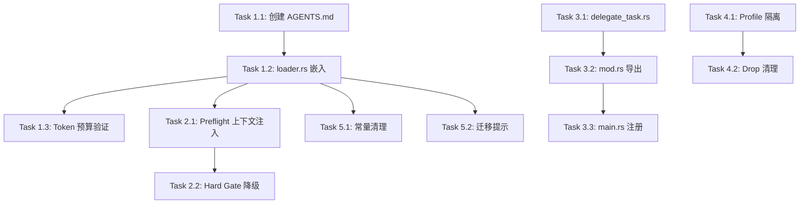

# Nova V5 实施任务清单

> 版本: 0.1-draft
> 日期: 2026-04-24

---

## 实施阶段

### Phase 1：AGENTS.md 基础设施（优先级最高）

所有后续改动都依赖这一步——先建立 AGENTS.md 文件和注入管线。

#### Task 1.1：创建 `nova-core/prompts/AGENTS.md`

**改动**：新建文件

编写完整的 AGENTS.md 内容，包含：
- 任务派发规则（High/Medium/Low → 对应动作）
- `<preflight>` 标签解读说明
- 记忆系统操作规范（从 `MEMORY_GUIDANCE` 迁移）
- 技能系统操作规范（从 `SKILLS_GUIDANCE` 迁移）
- SubAgent 行为指南段落
- 安全红线

**验证**：文件内容不超过 5000 字符

#### Task 1.2：修改 `loader.rs` — `include_str!` 嵌入 + 注入管线

**改动**：
- 新增 `const BUILTIN_AGENTS: &str = include_str!("../prompts/AGENTS.md");`
- 删除 `MEMORY_GUIDANCE` 常量
- 删除 `SKILLS_GUIDANCE` 常量
- 修改 `build_system_prompt()` 的组装顺序：第一层(SOUL/IDENTITY) → 第二层(BUILTIN_AGENTS) → 第三层(tools) → 第四层(USER/MEMORY/HEARTBEAT)

**验证**：编译通过；`daemon.log` 中确认 system prompt 包含 AGENTS.md 内容

#### Task 1.3：验证 Token 预算

**改动**：无代码改动

重启 daemon，观察 `Pre-flight budget` 日志中的 `estimated_tokens`，确认 AGENTS.md 注入后 token 消耗增量在可控范围内（<2000 tokens）。

---

### Phase 2：Preflight 上下文注入（核心架构变更）

将 Preflight 从"控制器"转变为"顾问"。

#### Task 2.1：修改 `loop.rs` — 移除工具过滤，注入 `<preflight>`

**改动**：
- 删除 L184-192 的 `as_api_schemas_filtered` 调用
- 改为始终使用 `self.tools.as_api_schemas()`
- 在构建 API 请求前，将 preflight 结果以 `<preflight>` 标签追加到 system prompt 末尾
- 删除 `allowed_tool_names` 变量

**依赖**：Task 1.1, 1.2（AGENTS.md 必须已包含派发规则）

**验证**：
- LLM 收到完整工具列表 + `<preflight>` 上下文
- LLM 根据 AGENTS.md 规则自主选择 delegate_task 或 delegate_complex_project

#### Task 2.2：修改 `loop.rs` — Hard Gate 降级为软提示

**改动**：
- 将 L480-492 的 BLOCKED 逻辑改为"软提示"模式
- 第一次违规：返回建议性消息（不阻断）
- 连续 3 次违规：升级为硬拦截
- 日志级别从 `warn` 降为 `debug`

**依赖**：Task 2.1

**验证**：
- 正常情况下 LLM 按 AGENTS.md 规则行事，hard gate 不触发
- 异常情况（LLM 多次忽略规则）时 hard gate 仍然生效

---

### Phase 3：delegate_task 工具（新功能）

#### Task 3.1：新建 `nova-core/src/tools/delegate_task.rs`

**改动**：新建文件

实现 `DelegateTaskTool` 结构体：
- `execute()` 启动单次 Full SubAgent（`SubagentType::Full` + tools）
- 复用 `RUNNING_PROJECTS` 注册表
- 完成后 `emitter.emit(ShadowEvent::ProjectCompleted { ... })`

**验证**：编译通过

#### Task 3.2：修改 `tools/mod.rs` — 导出新模块

**改动**：
- 新增 `pub mod delegate_task;`
- 新增 `pub use delegate_task::DelegateTaskTool;`

**依赖**：Task 3.1

#### Task 3.3：修改 `nova-daemon/src/main.rs` — 注册新工具

**改动**：
- 在 `make_tools()` 中注册 `DelegateTaskTool`
- 传入 `subagent_tools` (Arc\<ToolRegistry\>)

**依赖**：Task 3.1, 3.2

**验证**：daemon 启动日志中确认 `delegate_task` 出现在已注册工具列表中

---

### Phase 4：SubAgent 资源隔离

#### Task 4.1：修改 `main.rs` — SubAgent BrowserTool 独立 Profile

**改动**：
- `make_subagent_tools()` 中为 BrowserTool 传入独立的 profile 目录路径
- Profile 路径格式：`~/.nova/chrome-subagent/`

**验证**：SubAgent 使用 browser 时不触发 `WS Invalid message` 错误

#### Task 4.2：BrowserTool Drop 清理

**改动**：
- 确认 `browser.rs` 的 Drop 实现正确 kill Chrome 子进程
- SubAgent 完成后清理 profile 目录

**验证**：`ps aux | grep chrome` 确认无孤儿进程

---

### Phase 5：废弃清理

#### Task 5.1：清理 `loader.rs` 残留常量

**改动**：
- 删除 `MEMORY_GUIDANCE` 常量定义（已在 Task 1.2 完成）
- 删除 `SKILLS_GUIDANCE` 常量定义（已在 Task 1.2 完成）

**依赖**：Phase 1 完成

#### Task 5.2：用户工作区迁移提示

**改动**：
- 在 daemon 启动时检测 `~/.nova/AGENTS.md` 是否存在
- 如果存在，输出 `info!("检测到旧的 AGENTS.md，该文件已被内置版本替代，可安全删除")`

**依赖**：Phase 1 完成

---

## 依赖关系

**关键路径**：Phase 1 → Phase 2 → Phase 3（串行）
**可并行**：Phase 3 和 Phase 4 可并行实施（无依赖）
**最后执行**：Phase 5（清理，所有功能验证通过后）

---

## 风险评估

| 风险 | 概率 | 影响 | 缓解 |
|------|------|------|------|
| LLM 无视 AGENTS.md 派发规则，直接调工具 | 中 | 中 | hard gate 安全网 + 违规计数器 |
| AGENTS.md 内容过长，挤占用户上下文空间 | 低 | 低 | 控制在 5000 字以内 |
| Preflight 分类不准，High 被判为 Low | 中 | 中 | Preflight 的 few-shot 示例需持续优化 |
| SubAgent Chrome 进程泄漏 | 低 | 中 | Drop 清理 + daemon 启动时扫描孤儿进程 |

---

## 估算工时

| Phase | 预估 | 说明 |
|-------|------|------|
| Phase 1 | 1h | 主要是编写 AGENTS.md 内容 + loader.rs 小改 |
| Phase 2 | 1h | loop.rs 删减代码为主 |
| Phase 3 | 1h | 参考 delegate_complex_project.rs 编写 |
| Phase 4 | 0.5h | make_subagent_tools 改 1 行 + 验证 Drop |
| Phase 5 | 0.5h | 删代码 + 加日志 |
| **合计** | **~4h** | |
